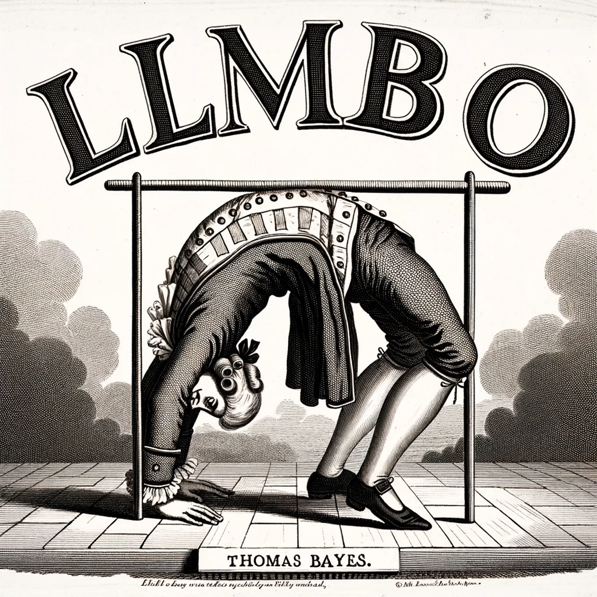

<!-- Do the above, but make the image on the right of the readme -->

<!--
<p align="center">
  
</p>
-->
[](https://github.com/psf/black) [](https://opensource.org/licenses/MIT)

Code for _Expert-Guided Bayesian Optimisation for Human-In-The-Loop Experimental Design of Engineering Systems._

### Requirements 
- A working Anaconda distribution

### Instructions 

1. ```$ git clone git@github.com:OptiMaL-PSE-Lab/humbo.git```
2. ```$ conda env create -f enviroment.yml```

The main HUMBO loop is at `bo/humbo.py`
